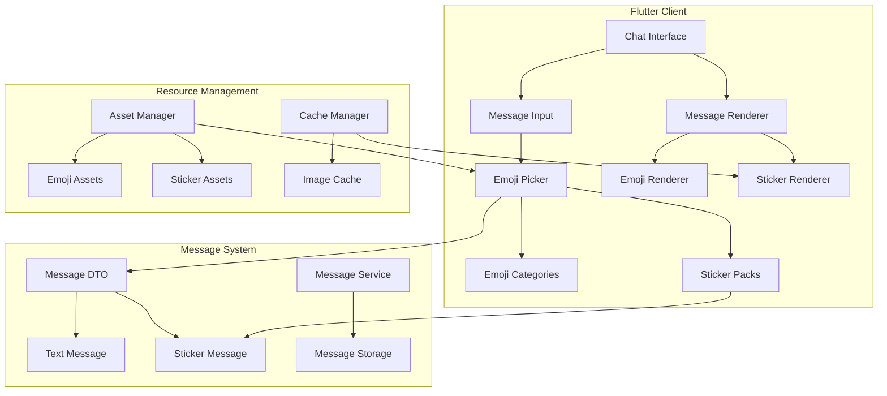
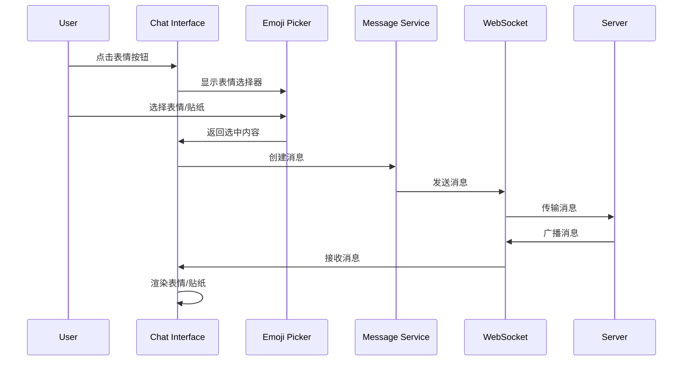

# GoChat 表情包功能设计文档

## Overview

本设计文档详细描述了 GoChat 表情包功能的技术实现方案。该功能将在现有的聊天系统基础上，添加表情符号（Emoji）和贴纸（Sticker）支持，包括客户端界面组件、消息类型扩展、资源管理和服务端支持。

设计目标：
- 提供流畅的表情符号选择和发送体验
- 支持多种贴纸包和自定义贴纸
- 保持跨平台一致性
- 优化性能和资源使用
- 与现有消息系统无缝集成

## Architecture

### 整体架构



### 消息流程架构



## Components and Interfaces

### 1. 表情选择器组件 (EmojiPicker)

**现有组件增强**
```dart
class EmojiPicker extends StatefulWidget {
  final Function(String) onEmojiSelected;
  final Function(StickerItem) onStickerSelected;
  final bool showStickers;
  
  // 新增功能
  final List<String> recentEmojis;
  final Function(String) onEmojiSearch;
  final bool enableSearch;
}
```

**主要功能模块：**
- **EmojiCategoryTab**: 表情分类标签
- **EmojiGrid**: 表情网格显示
- **StickerPackTab**: 贴纸包标签
- **StickerGrid**: 贴纸网格显示
- **RecentEmojis**: 最近使用的表情
- **EmojiSearch**: 表情搜索功能

### 2. 贴纸管理组件

**StickerManager**
```dart
class StickerManager {
  static final StickerManager _instance = StickerManager._internal();
  factory StickerManager() => _instance;
  
  List<StickerPack> _stickerPacks = [];
  Map<String, ui.Image> _imageCache = {};
  
  Future<List<StickerPack>> loadStickerPacks();
  Future<ui.Image> loadStickerImage(String path);
  void cacheImage(String path, ui.Image image);
}
```

**StickerPack 数据模型**
```dart
class StickerPack {
  final String id;
  final String name;
  final String iconPath;
  final List<StickerItem> stickers;
  final String category;
}

class StickerItem {
  final String id;
  final String name;
  final String imagePath;
  final String packId;
  final Map<String, dynamic> metadata;
}
```

### 3. 消息类型扩展

**消息 DTO 扩展**
```dart
enum MessageType {
  text,
  image,
  video,
  emoji,      // 新增
  sticker,    // 新增
}

class StickerMessageContent {
  final String stickerId;
  final String stickerPackId;
  final String imagePath;
  final int width;
  final int height;
}
```

### 4. 消息渲染组件

**MessageBubble 扩展**
```dart
class MessageBubble extends StatelessWidget {
  Widget _buildMessageContent() {
    switch (message.type) {
      case MessageType.emoji:
        return EmojiMessageWidget(content: message.content);
      case MessageType.sticker:
        return StickerMessageWidget(
          stickerContent: message.stickerContent,
        );
      // ... 其他类型
    }
  }
}
```

**EmojiMessageWidget**
```dart
class EmojiMessageWidget extends StatelessWidget {
  final String content;
  
  Widget build(BuildContext context) {
    // 检测纯表情消息并放大显示
    if (_isPureEmoji(content)) {
      return _buildLargeEmoji(content);
    }
    return _buildMixedContent(content);
  }
}
```

**StickerMessageWidget**
```dart
class StickerMessageWidget extends StatelessWidget {
  final StickerMessageContent stickerContent;
  
  Widget build(BuildContext context) {
    return FutureBuilder<ui.Image>(
      future: StickerManager().loadStickerImage(stickerContent.imagePath),
      builder: (context, snapshot) {
        if (snapshot.hasData) {
          return _buildStickerImage(snapshot.data!);
        }
        return _buildLoadingPlaceholder();
      },
    );
  }
}
```

## Data Models

### 1. 客户端数据模型

**表情符号分类**
```dart
class EmojiCategory {
  final String id;
  final String name;
  final String icon;
  final List<String> emojis;
  final int order;
  
  // 预定义分类
  static const List<EmojiCategory> defaultCategories = [
    EmojiCategory(id: 'smileys', name: '笑脸', icon: '😀', ...),
    EmojiCategory(id: 'gestures', name: '手势', icon: '👋', ...),
    EmojiCategory(id: 'animals', name: '动物', icon: '🐶', ...),
    // ...
  ];
}
```

**用户表情偏好**
```dart
class UserEmojiPreferences {
  final List<String> recentEmojis;
  final List<String> favoriteEmojis;
  final Map<String, int> emojiUsageCount;
  final DateTime lastUpdated;
  
  void addRecentEmoji(String emoji);
  void addFavoriteEmoji(String emoji);
  List<String> getMostUsedEmojis(int count);
}
```

### 2. 服务端数据模型扩展

**消息表扩展 (Go/Ent)**
```go
// 扩展现有的 ChatRecord schema
func (ChatRecord) Fields() []ent.Field {
    return []ent.Field{
        // ... 现有字段
        field.Enum("message_type").
            Values("text", "image", "video", "emoji", "sticker").
            Default("text"),
        field.JSON("sticker_content", &StickerContent{}).
            Optional(),
    }
}

type StickerContent struct {
    StickerID   string `json:"sticker_id"`
    PackID      string `json:"pack_id"`
    ImagePath   string `json:"image_path"`
    Width       int    `json:"width"`
    Height      int    `json:"height"`
}
```

**贴纸包配置**
```go
type StickerPackConfig struct {
    ID          string           `json:"id"`
    Name        string           `json:"name"`
    Version     string           `json:"version"`
    IconPath    string           `json:"icon_path"`
    Stickers    []StickerConfig  `json:"stickers"`
    Category    string           `json:"category"`
    CreatedAt   time.Time        `json:"created_at"`
}

type StickerConfig struct {
    ID        string            `json:"id"`
    Name      string            `json:"name"`
    ImagePath string            `json:"image_path"`
    Width     int               `json:"width"`
    Height    int               `json:"height"`
    Tags      []string          `json:"tags"`
    Metadata  map[string]string `json:"metadata"`
}
```

## Error Handling

### 1. 客户端错误处理

**表情选择器错误**
```dart
class EmojiPickerErrorHandler {
  static void handleStickerLoadError(String packId, Exception error) {
    // 记录错误日志
    Logger.error('Failed to load sticker pack: $packId', error);
    
    // 显示用户友好的错误信息
    showSnackBar('贴纸包加载失败，请稍后重试');
    
    // 回退到默认表情
    _fallbackToEmojis();
  }
  
  static void handleImageCacheError(String imagePath, Exception error) {
    // 清理损坏的缓存
    ImageCache().clearCache(imagePath);
    
    // 重新加载图片
    _retryImageLoad(imagePath);
  }
}
```

**消息发送错误**
```dart
class MessageSendErrorHandler {
  static Future<void> handleStickerSendError(
    StickerMessageContent content,
    Exception error,
  ) async {
    if (error is NetworkException) {
      // 网络错误，标记消息为待发送
      await _markMessageAsPending(content);
    } else if (error is StickerNotFoundError) {
      // 贴纸不存在，回退到文本消息
      await _fallbackToTextMessage(content.name);
    }
  }
}
```

### 2. 服务端错误处理

**消息类型验证**
```go
func ValidateMessageContent(msgType string, content interface{}) error {
    switch msgType {
    case "sticker":
        stickerContent, ok := content.(*StickerContent)
        if !ok {
            return errors.New("invalid sticker content format")
        }
        return validateStickerContent(stickerContent)
    case "emoji":
        // 验证 emoji 内容
        return validateEmojiContent(content)
    default:
        return nil
    }
}

func validateStickerContent(content *StickerContent) error {
    if content.StickerID == "" {
        return errors.New("sticker ID is required")
    }
    if content.PackID == "" {
        return errors.New("pack ID is required")
    }
    if content.ImagePath == "" {
        return errors.New("image path is required")
    }
    return nil
}
```

## Testing Strategy

### 1. 单元测试

**表情选择器测试**
```dart
group('EmojiPicker Tests', () {
  testWidgets('should display emoji categories', (tester) async {
    await tester.pumpWidget(EmojiPicker(
      onEmojiSelected: (emoji) {},
      onStickerSelected: (sticker) {},
    ));
    
    expect(find.text('😀'), findsOneWidget);
    expect(find.text('👋'), findsOneWidget);
    expect(find.text('🐶'), findsOneWidget);
  });
  
  testWidgets('should call callback when emoji selected', (tester) async {
    String? selectedEmoji;
    
    await tester.pumpWidget(EmojiPicker(
      onEmojiSelected: (emoji) => selectedEmoji = emoji,
      onStickerSelected: (sticker) {},
    ));
    
    await tester.tap(find.text('😀'));
    expect(selectedEmoji, equals('😀'));
  });
});
```

**贴纸管理器测试**
```dart
group('StickerManager Tests', () {
  test('should load sticker packs from assets', () async {
    final manager = StickerManager();
    final packs = await manager.loadStickerPacks();
    
    expect(packs.length, greaterThan(0));
    expect(packs.first.stickers.length, greaterThan(0));
  });
  
  test('should cache loaded images', () async {
    final manager = StickerManager();
    final image = await manager.loadStickerImage('test_sticker.png');
    
    expect(manager._imageCache.containsKey('test_sticker.png'), isTrue);
  });
});
```

### 2. 集成测试

**消息发送流程测试**
```dart
group('Emoji Message Integration Tests', () {
  testWidgets('should send and receive emoji messages', (tester) async {
    // 模拟完整的表情消息发送和接收流程
    await tester.pumpWidget(ChatApp());
    
    // 打开表情选择器
    await tester.tap(find.byIcon(Icons.emoji_emotions));
    await tester.pumpAndSettle();
    
    // 选择表情
    await tester.tap(find.text('😀'));
    
    // 发送消息
    await tester.tap(find.byIcon(Icons.send));
    await tester.pumpAndSettle();
    
    // 验证消息显示
    expect(find.text('😀'), findsOneWidget);
  });
});
```

### 3. 性能测试

**资源加载性能测试**
```dart
group('Performance Tests', () {
  test('sticker loading should complete within 500ms', () async {
    final stopwatch = Stopwatch()..start();
    
    final manager = StickerManager();
    await manager.loadStickerPacks();
    
    stopwatch.stop();
    expect(stopwatch.elapsedMilliseconds, lessThan(500));
  });
  
  test('emoji picker should render within 100ms', () async {
    await tester.pumpWidget(EmojiPicker(
      onEmojiSelected: (emoji) {},
      onStickerSelected: (sticker) {},
    ));
    
    final stopwatch = Stopwatch()..start();
    await tester.pumpAndSettle();
    stopwatch.stop();
    
    expect(stopwatch.elapsedMilliseconds, lessThan(100));
  });
});
```

### 4. 服务端测试

**消息类型处理测试**
```go
func TestStickerMessageHandling(t *testing.T) {
    // 测试贴纸消息的创建和存储
    stickerContent := &StickerContent{
        StickerID: "sticker_001",
        PackID:    "pack_001",
        ImagePath: "/stickers/pack_001/sticker_001.png",
        Width:     120,
        Height:    120,
    }
    
    message := &ChatRecord{
        MsgID:          generateMsgID(),
        FromUserID:     1,
        ToUserID:       2,
        MessageType:    "sticker",
        StickerContent: stickerContent,
        CreateTime:     time.Now(),
    }
    
    err := messageService.SaveMessage(message)
    assert.NoError(t, err)
    
    // 验证消息检索
    retrieved, err := messageService.GetMessage(message.MsgID)
    assert.NoError(t, err)
    assert.Equal(t, "sticker", retrieved.MessageType)
    assert.Equal(t, stickerContent.StickerID, retrieved.StickerContent.StickerID)
}
```

## Implementation Notes

### 1. 资源组织结构

```
assets/
├── emojis/
│   └── emoji_data.json          # 表情符号数据配置
├── stickers/
│   ├── pack_001_cute/
│   │   ├── config.json          # 贴纸包配置
│   │   ├── icon.png            # 贴纸包图标
│   │   ├── sticker_001.png     # 贴纸图片
│   │   └── ...
│   ├── pack_002_funny/
│   │   └── ...
│   └── pack_003_animals/
│       └── ...
└── fonts/
    └── emoji_font.ttf          # 表情符号字体（可选）
```

### 2. 性能优化策略

**图片缓存策略**
- 使用 LRU 缓存算法管理内存中的图片
- 实现磁盘缓存用于持久化常用贴纸
- 支持预加载热门贴纸包

**懒加载实现**
- 贴纸包按需加载，减少应用启动时间
- 表情分类延迟渲染，提高界面响应速度
- 图片异步解码，避免 UI 阻塞

**内存管理**
- 定期清理未使用的图片缓存
- 监控内存使用情况，自动释放资源
- 使用弱引用避免内存泄漏

### 3. 跨平台兼容性

**字体处理**
- 使用 Google Fonts 的 Noto Color Emoji 确保一致性
- 为不支持彩色表情的平台提供回退方案
- 处理不同平台的字体渲染差异

**文件路径处理**
- 使用相对路径引用资源文件
- 处理不同平台的路径分隔符
- 支持资源文件的动态加载

### 4. 扩展性设计

**插件化架构**
- 支持第三方贴纸包的动态加载
- 提供贴纸包开发 SDK
- 实现贴纸包的版本管理和更新机制

**国际化支持**
- 支持多语言的表情符号描述
- 提供本地化的贴纸包
- 适配不同文化背景的表情使用习惯