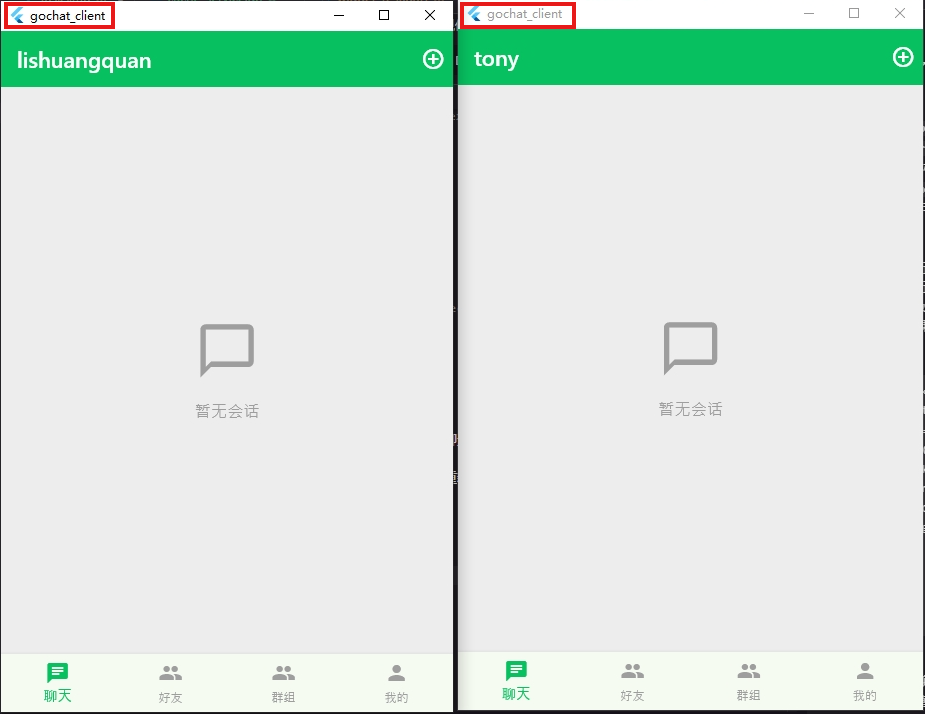
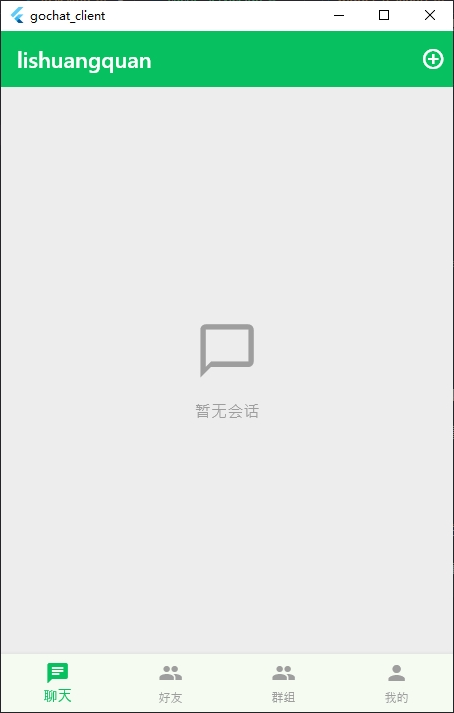
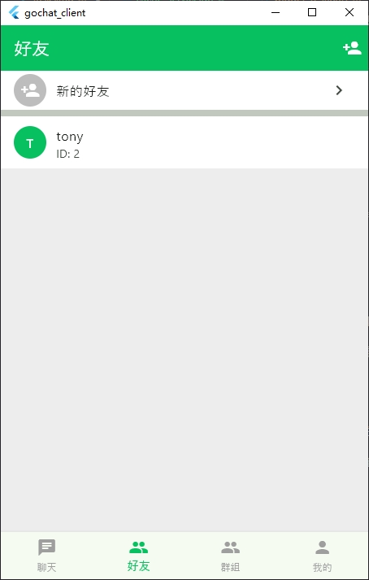
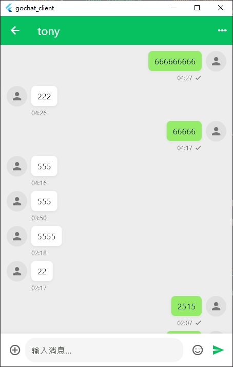
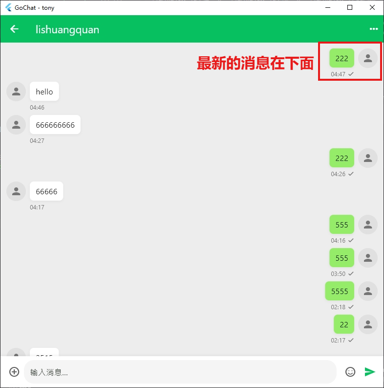

# GoChat 实现任务列表

- [x] 1. 完善后端认证和Token管理

  - 实现JWT token生成和验证功能
  - 实现密码加密存储（bcrypt）
  - 创建认证中间件用于保护API端点
  - _Requirements: 1.1, 1.2, 1.3_

- [x] 2. 实现好友管理功能

  - [x] 2.1 创建FriendRequest数据模型

    - 在ent/schema中创建friendrequest.go

    - 定义好友请求的字段（fromUserId, toUserId, remark, status, createTime）
    - 运行ent generate生成代码
    - _Requirements: 5.1, 5.2_
  
  - [x] 2.2 实现FriendService

    - 实现发送好友请求功能
    - 实现接受/拒绝好友请求功能
    - 实现获取好友列表功能

    - 实现删除好友功能
    - _Requirements: 5.1, 5.2, 5.3_
  

  - [x] 2.3 创建FriendController

    - 实现POST /api/friends/request接口

    - 实现POST /api/friends/accept接口
    - 实现GET /api/friends接口
    - 实现DELETE /api/friends/:friendId接口
    - _Requirements: 5.1, 5.2, 5.3_

- [x] 3. 完善消息发送和接收功能

  - [x] 3.1 实现MessageService

    - 实现SendMessage功能（支持文本、图片、视频）

    - 实现GetChatHistory功能（分页查询）
    - 实现GetOfflineMessages功能
    - 实现消息状态管理
    - _Requirements: 3.1, 3.2, 3.3, 3.4, 3.5, 8.1, 8.2, 8.3_

  
  - [x] 3.2 创建MessageController

    - 实现POST /api/messages/send接口
    - 实现GET /api/messages/history接口

    - 添加认证中间件保护
    - _Requirements: 3.1, 3.2, 8.1, 8.2_
  
  - [x] 3.3 完善WebSocket消息处理

    - 实现消息接收处理逻辑（msg_recv_handler）
    - 实现消息发送处理逻辑（msg_send_handler）

    - 实现在线用户消息实时推送
    - 实现离线消息存储和推送
    - _Requirements: 2.1, 2.2, 2.3, 2.4, 2.5, 3.1, 3.2, 3.3_

- [x] 4. 实现文件上传功能

  - [x] 4.1 集成MinIO客户端

    - 添加MinIO Go SDK依赖

    - 实现MinIO连接配置
    - 创建FileService处理文件上传
    - _Requirements: 4.1, 4.2, 4.3_
  
  - [x] 4.2 实现文件上传接口

    - 实现POST /api/messages/upload接口
    - 添加文件类型验证

    - 添加文件大小限制（图片<10MB，视频<100MB）
    - 返回文件访问URL
    - _Requirements: 4.1, 4.2, 4.3, 4.4, 4.5_

- [x] 5. 实现群组管理功能

  - [x] 5.1 实现GroupService

    - 实现CreateGroup功能
    - 实现GetUserGroups功能
    - 实现AddGroupMembers功能
    - 实现RemoveGroupMember功能
    - 实现GetGroupMembers功能

    - _Requirements: 6.1, 6.2, 6.3, 6.4, 6.5_

  
  - [x] 5.2 创建GroupController

    - 实现POST /api/groups接口
    - 实现GET /api/groups接口
    - 实现POST /api/groups/:groupId/members接口
    - 实现DELETE /api/groups/:groupId/members/:userId接口
    - _Requirements: 6.1, 6.2, 6.3, 6.4_
-

- [x] 6. 实现群聊消息功能

- [ ] 6. 实现群聊消息功能

  - [x] 6.1 创建GroupChatRecord数据模型（如果不存在）

    - 验证ent/schema中的groupchatrecord.go
    - 确保包含必要字段
    - _Requirements: 7.1_

  
  - [x] 6.2 实现群聊消息发送

    - 在MessageService中添加群聊消息发送逻辑
    - 实现群消息广播给所有在线成员

    - 实现离线成员消息存储
    - _Requirements: 7.1, 7.2, 7.3, 7.4, 7.5_
  

  - [x] 6.3 实现群聊历史查询

    - 在MessageService中添加GetGroupChatHistory功能
    - 支持分页查询
    - _Requirements: 8.2, 8.3, 8.4_

- [x] 7. 初始化Flutter客户端项目

  - [x] 7.1 创建Flutter项目结构

    - 在src/client目录创建Flutter项目
    - 配置pubspec.yaml添加必要依赖
    - 创建基础目录结构（lib/models, lib/services, lib/pages, lib/widgets）

    - _Requirements: 9.1_
  -

  - [x] 7.2 添加必要的依赖包

  - [ ] 7.2 添加必要的依赖包

    - 添加dio（HTTP客户端）
    - 添加web_socket_channel（WebSocket）

    - 添加provider或riverpod（状态管理）
    - 添加flutter_secure_storage（安全存储）
    - 添加image_picker（图片选择）
    - 添加cached_network_image（图片缓存）

    - _Requirements: 10.1, 10.2_

- [x] 8. 实现Flutter客户端核心服务

  - [x] 8.1 实现ApiService

    - 创建HTTP客户端封装
    - 实现用户注册接口调用
    - 实现用户登录接口调用

    - 实现消息发送接口调用
    - 实现文件上传接口调用
    - _Requirements: 1.1, 1.2, 3.1_
  

-

  - [x] 8.2 实现WebSocketService

    - 创建WebSocket连接管理
    - 实现连接、断开、重连逻辑
    - 实现消息发送和接收
    - 实现心跳机制
    - _Requirements: 2.1, 2.2, 10.1, 10.2, 10.3_
  

  - [x] 8.3 实现StorageService

    - 实现Token存储和读取
    - 实现用户信息本地缓存
    - 实现聊天记录本地存储
    - _Requirements: 1.2_

- [x] 9. 实现Flutter客户端数据模型

  - 创建User模型类
  - 创建Message模型类
  - 创建Conversation模型类
  - 创建Group模型类
  - 实现JSON序列化和反序列化

  - _Requirements: 9.1_

- [x] 10. 实现Flutter客户端状态管理

  - [x] 10.1 创建UserState

    - 管理当前用户信息

    - 管理登录状态
    - 管理Token
    - _Requirements: 1.2, 1.3_
  
  - [x] 10.2 创建ChatState

    - 管理会话列表
    - 管理消息列表
    - 管理WebSocket连接状态
    - _Requirements: 3.1, 10.2_
  
  - [x] 10.3 创建FriendState

    - 管理好友列表

    - 管理好友请求

    - _Requirements: 5.1, 5.2_
  
  - [x] 10.4 创建GroupState

    - 管理群组列表

    - 管理群成员信息
    - _Requirements: 6.1, 6.4_

- [x] 11. 实现Flutter登录和注册界面

  - [x] 11.1 创建登录页面

    - 设计登录UI（微信绿色风格）
    - 实现用户名密码输入
    - 实现登录按钮和逻辑
    - 实现错误提示
    - _Requirements: 1.2, 9.1, 9.2_

  
  - [x] 11.2 创建注册页面

    - 设计注册UI
    - 实现用户名、密码、昵称输入
    - 实现注册按钮和逻辑
    - 实现表单验证

    - _Requirements: 1.1, 9.2_

- [x] 12. 实现Flutter聊天列表界面

  - 创建聊天列表页面
  - 实现会话列表展示
  - 实现最后一条消息预览

  - 实现未读消息数量显示

  - 实现下拉刷新
  - _Requirements: 9.3, 10.2_

- [x] 13. 实现Flutter聊天界面

  - [x] 13.1 创建聊天页面基础UI

    - 设计聊天界面布局
    - 实现消息气泡组件
    - 实现输入框和发送按钮
    - 实现消息时间显示

    - _Requirements: 9.4, 10.2_

  
  - [x] 13.2 实现消息发送功能

    - 实现文本消息发送
    - 实现消息发送状态显示
    - 实现消息失败重试

    - _Requirements: 3.1, 10.4_
  
  - [x] 13.3 实现消息接收功能

    - 实现WebSocket消息监听

    - 实现新消息自动滚动

    - 实现消息通知
    - _Requirements: 10.2, 10.5_
  
  - [x] 13.4 实现多媒体消息

    - 实现图片选择和发送

    - 实现图片消息展示
    - 实现图片预览
    - 实现视频消息支持
    - _Requirements: 3.3, 4.1, 4.2_

-

- [x] 14. 实现Flutter好友列表界面

  - 创建好友列表页面
  - 实现好友列表展示
  - 实现添加好友功能
  - 实现好友请求列表
  - 实现接受/拒绝好友请求

  - _Requirements: 5.1, 5.2, 9.5_
- [ ] 15. 实现Flutter群组功能界面

- [ ] 15. 实现Flutter群组功能界面

  - [x] 15.1 创建群组列表页面

    - 实现群组列表展示
    - 实现创建群组入口
    - _Requirements: 6.1, 6.4, 9.5_
  

  - [x] 15.2 创建群组详情页面

    - 实现群成员列表展示
    - 实现添加群成员功能
    - 实现移除群成员功能（群主权限）

    - _Requirements: 6.2, 6.3_
  
  - [x] 15.3 实现群聊界面

    - 复用聊天界面组件
    - 实现群消息发送
    - 实现群消息接收
    - 显示消息发送者昵称
    - _Requirements: 7.1, 7.2, 7.3, 7.4, 7.5_

- [x] 16. 实现Flutter个人信息界面

  - 创建个人信息页面
  - 实现用户信息展示
  - 实现昵称修改功能

  - 实现退出登录功能
  - _Requirements: 1.3_

- [x] 17. 完善后端错误处理和日志

  - 实现统一错误响应格式

  - 添加Recovery中间件
  - 添加日志记录

  - 实现请求日志中间件
  - _Requirements: 所有_

- [x] 18. 实现消息状态管理

  - [x] 18.1 创建MessageStatus数据模型

    - 在ent/schema中创建messagestatus.go
    - 定义消息状态字段
    - 运行ent generate
    - _Requirements: 3.5, 8.5_
  
  - [x] 18.2 实现消息送达和已读功能

    - 实现消息送达确认

    - 实现消息已读确认
    - 通过WebSocket推送状态更新

    - _Requirements: 3.5_

- [ ] 19. 优化和性能提升

  - [ ] 19.1 后端性能优化

    - 配置数据库连接池
    - 添加数据库索引
    - 实现Redka缓存热点数据
    - _Requirements: 所有_
  

  - [ ] 19.2 前端性能优化

    - 实现聊天记录懒加载
    - 实现图片缓存
    - 优化状态管理减少rebuild
    - _Requirements: 9.1, 10.2_

- [ ] 20. 测试和文档
  - [ ] 20.1 后端测试
    - 编写Services层单元测试
    - 编写API集成测试
    - 编写WebSocket测试
    - _Requirements: 所有_
  
  - [ ] 20.2 前端测试
    - 编写Widget测试
    - 编写状态管理测试
    - 编写集成测试
    - _Requirements: 所有_
  
  - [ ] 20.3 文档完善
    - 完善API文档
    - 编写部署文档
    - 编写用户使用文档
    - _Requirements: 所有_

  - [x] 21 全面修复错误

    - 修复server端错误
    - 修复client端错误

- [x] 22 客户端问题优化1

  - 聊天需要有消息通知，类似微信这样，消息来了闪动，聊天列表中显示未读消息条数，并显示最近一条聊天记录
  - 好友请求实时通知，有好友申请，能够有提醒，而不用重新登陆才看的到
  - 设置功能需要开发，具体功能：1.设置主题，支持颜色、亮暗色设置。2.服务器地址设置等

- [x] 23 问题优化

  - 登陆之后，window上方的标题要显示登陆的用户名，现在的情况如下，红色框起来的部分，需要修改：
  
  - 与好友聊天之后，聊天栏还是空白的，应该有记录可以直接点进去，而不是在好友那里去找：
  
  - 允许客户端多开，登陆不同的账户，用户数据存放在程序目录下，区分用户存放

- [x] 24 问题优化2

  - 用户关闭客户端之后，再打开，需要重新登陆
  - 与好友聊天界面，最新的消息在最下面,与微信聊天界面保持一致，并且消息下面的日期显示格式为yyyy-MM-dd HH:mm:ss：
  - 发送消息之后，目前的情况是：对方需要重新进聊天界面才能看到消息，而且本人的消息已读情况也需要关闭聊天界面重新进才更新消息已读状态。希望修改的情况：对方在聊天界面就能实时看到聊天消息及消息的已读情况
  - 发送消息之后，聊天界面的聊天列表没有气泡显示未读消息条数，客户端也没有任务栏红色通知