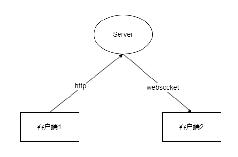

# GoChat

## 技术栈思考

- server使用go/gin/Gorilla WebSocket

- client使用C#/Avalonia实现桌面跨平台，maui实现移动端跨平台

- http:用户注册、登录等信息

- websocket：服务端主动给客户端发送消息

- minio:存储非文字信息

- 数据库使用postgreysql

## 聊天过程

### 单聊

对方在线：

对方不在线：

### 群聊
